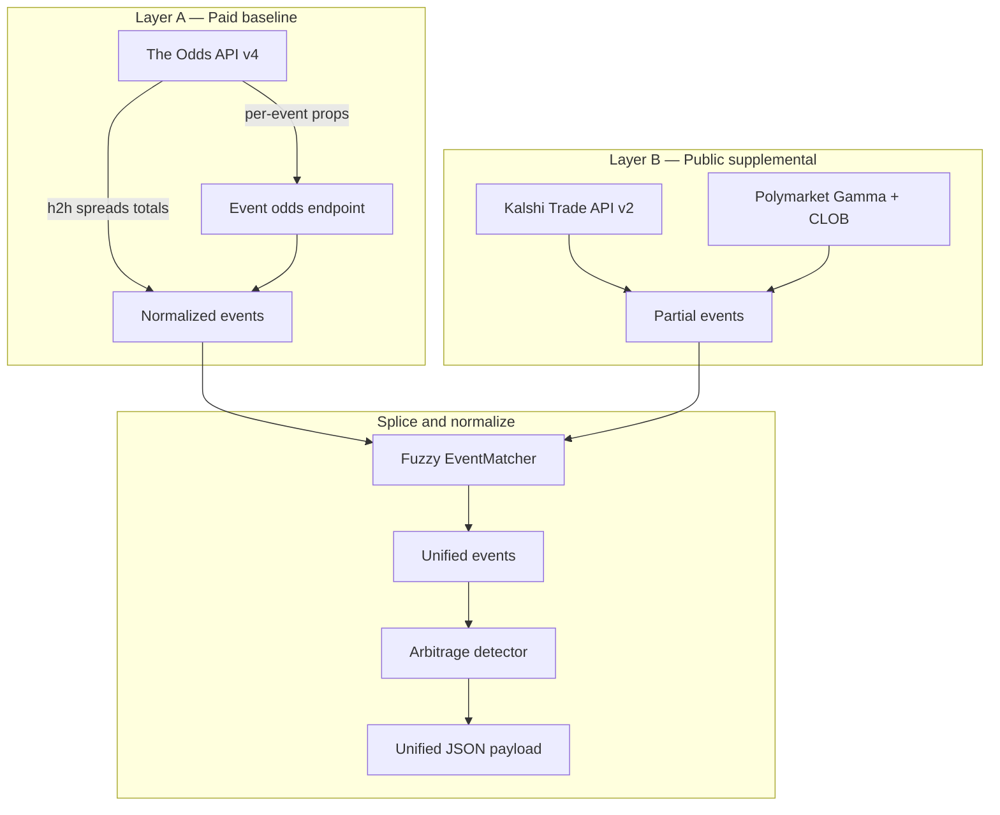

# arb-harvest

Modular, multi-threaded odds harvester for cross-book arbitrage research. It uses your **paid [The Odds API](https://the-odds-api.com)** subscription as the authoritative baseline for US sportsbooks, then **splices** supplemental **public** prediction-market APIs (Kalshi, Polymarket) with fuzzy team matching and emits a unified JSON payload including arbitrage yield estimates.

This package intentionally does **not** implement stealth scraping, anti-bot bypass, residential proxy rotation, or undocumented “hidden endpoint” harvesting. Those approaches violate most operator terms of service and create legal/compliance risk. Extend `arb_harvest/scrape/` only with **authorized** APIs you are permitted to use.

## Architecture



### Platform coverage map

| Platform | How this repo covers it |
|----------|-------------------------|
| DraftKings, FanDuel, BetMGM, Caesars, Fanatics, bet365, ESPN Bet / The Score | **The Odds API** `bookmakers[].key` (see `US_SPORTSBOOK_KEYS` in `config.py`) |
| Kalshi | **Public** `api.elections.kalshi.com/trade-api/v2` |
| Polymarket | **Public** Gamma `/events` (tagged sports) + CLOB `/book` |
| SportX / SX Bet | **Public** `api.sx.bet/markets/active` + `/orders?marketHash=` |
| Betfair Exchange | **Official API** when `BETFAIR_*` env vars set; also via Odds API `uk,eu` regions |
| Smarkets | Odds API `eu` region when on your plan; streaming API requires Smarkets approval |
| DraftKings Predictions, FanDuel Prediction | No stable public API — add licensed adapter under `scrape/` |

### Output schema (arbitrage signals)

Each opportunity includes:

- `timestamp`
- `normalized_event_name`
- `market_type`
- `source_A_odds_and_volume` / `source_B_odds_and_volume`
- `calculated_arbitrage_yield_percentage`
- `legs[]` with all best prices across sources

## Quick start

```bash
cd arb-harvest
python -m venv .venv && source .venv/bin/activate
pip install -r requirements.txt
cp .env.example .env
# Edit .env and set ODDS_API_KEY=your_key

python -m arb_harvest --once
python -m arb_harvest --loop
python -m arb_harvest --once -o /tmp/arb_snapshot.json
```

## Configuration

| Variable | Description |
|----------|-------------|
| `ODDS_API_KEY` | **Required** — The Odds API key |
| `ARB_SPORT_KEYS` | Comma-separated sport keys (default NBA/NFL/NHL/MLB) |
| `ARB_POLL_INTERVAL_SEC` | Loop interval (default `45`) |
| `ARB_MIN_YIELD_PCT` | Minimum arb % to emit (default `0.25`) |
| `ARB_HTTP_RPS` | Per-host request rate cap (default `2.0`) |
| `ARB_ENABLE_KALSHI` / `ARB_ENABLE_POLYMARKET` | Toggle supplemental sources |

## Module layout

```
arb_harvest/
  baseline/the_odds_api.py   # Paid baseline + event-level props
  scrape/kalshi.py           # Regulated prediction market (public API)
  scrape/polymarket.py       # Yes/No + CLOB depth
  scrape/registry.py         # Fetcher registration
  normalize/matcher.py       # rapidfuzz cross-source matching
  engine/orchestrator.py     # ThreadPool harvest + splice + arb
  net/http_client.py         # Polite rate limiting (not evasion)
```

## Extending with official exchange APIs

1. Subclass `SupplementalFetcher` in `scrape/base.py`.
2. Return `NormalizedEvent` rows with `SourceBook` entries.
3. Register in `scrape/registry.py`.
4. Map exchange **Back/Lay** or contract prices to American odds in your adapter (see `kalshi.py` for probability → American conversion).

## API server integration

When `ODDS_API_KEY` is set and Python 3 is available:

- `GET /harvest` — full unified payload
- `GET /harvest/signals` — arbitrage signals only
- `GET /harvest/health` — availability check

## Relationship to this monorepo

The TypeScript API server under `artifacts/api-server/` already scans arbs via Optic Odds (`ODDSJAM_API_KEY`) and merges **Kalshi** in `src/lib/kalshi.ts`. This Python package is a parallel path centered on **The Odds API** plus public prediction markets, suitable for batch pipelines or the `/harvest` routes.

## Compliance note

You are responsible for complying with each data provider’s terms, applicable gambling regulations, and rate limits. This tool uses documented HTTP APIs and conservative throttling; it does not bypass access controls.
