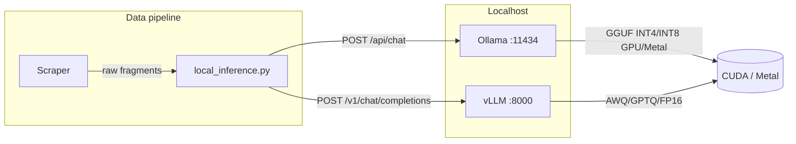

# Local Open-Weights LLM for Entity Normalization

Self-hosted, **unfiltered** localhost inference for normalizing messy sportsbook and prediction-market strings into canonical JSON keys. No cloud APIs, no content filters — raw strings in, minified JSON out.

## Architecture



| Component | Role |
|-----------|------|
| `docker-compose.yml` | Ollama (default) or vLLM with NVIDIA GPU |
| `local_inference.py` | Async pooled client, batch concurrency, JSON retry |
| `normalization_prompt.py` | System prompt + reference dictionary wrapper |
| `config.py` | Env-driven backend and latency tuning |

## Model recommendations (latency vs reasoning)

| Hardware | Model | Format | Typical use |
|----------|--------|--------|-------------|
| 24GB+ NVIDIA / Apple M-series Max | `llama3.3:70b-instruct-q4_K_M` | Ollama GGUF Q4 | Best fuzzy matching |
| 16GB VRAM | `deepseek-r1:8b-llama-distill-q4_K_M` | Ollama GGUF Q4 | Strong reasoning, lower RAM |
| 8–12GB VRAM / M1 16GB | `llama3.1:8b-instruct-q4_K_M` | Ollama GGUF Q4 | Highest tokens/sec |
| Multi-GPU server | `meta-llama/Meta-Llama-3.1-8B-Instruct` + vLLM | FP16/BF16 or AWQ HF repo | Batched OpenAI API |

Pull examples (Ollama):

```bash
ollama pull llama3.3:70b-instruct-q4_K_M
ollama pull llama3.1:8b-instruct-q4_K_M
ollama pull deepseek-r1:8b-llama-distill-q4_K_M
```

Set `OLLAMA_MODEL` in `.env` to match what fits your GPU RAM.

## Quick start

### 1. Environment

```bash
cd local-llm
chmod +x scripts/*.sh
./scripts/setup.sh ollama    # or: ./scripts/setup.sh vllm
source .venv/bin/activate
cp .env.example .env          # if not created by setup
```

**Native Ollama (macOS Apple Silicon — recommended for Metal):**

```bash
brew install ollama
ollama serve
ollama pull llama3.1:8b-instruct-q4_K_M
```

**Docker Ollama (Linux + NVIDIA):**

```bash
# Install nvidia-container-toolkit first
docker compose --profile ollama up -d
docker exec local-llm-ollama ollama pull llama3.1:8b-instruct-q4_K_M
```

**vLLM (NVIDIA, OpenAI-compatible):**

```bash
export VLLM_MODEL=meta-llama/Meta-Llama-3.1-8B-Instruct
# Optional: export HUGGING_FACE_HUB_TOKEN=... for gated models
docker compose --profile vllm up -d
# In .env: LOCAL_LLM_BACKEND=vllm
```

### 2. Verify GPU / Metal acceleration

```bash
./scripts/verify_gpu.sh
```

**CUDA active (NVIDIA):**

- `nvidia-smi` shows GPU utilization during `./scripts/verify_gpu.sh` inference probe.
- `ollama ps` lists `PROCESSOR` as `cuda` or `gpu` (not `cpu`).

**Metal active (Apple Silicon):**

- Native Ollama.app or `ollama` from Homebrew uses Metal automatically.
- Activity Monitor → GPU history spikes during `ollama run`.
- `ollama ps` may show `metal` on recent versions.

**CPU fallback (slow — fix this):**

- `ollama ps` shows `100% CPU` and no GPU columns → reduce model size or install GPU drivers / Metal Ollama.

### 3. Run normalization example

```bash
python examples/normalize_batch.py
```

Expected output shape:

```json
{
  "CHA Hornets": "Charlotte Hornets",
  "Charlotte": "Charlotte Hornets",
  ...
}
```

## Python API

```python
from local_inference import LocalInferenceClient

REFERENCE = {"id1": "Charlotte Hornets", "id2": "Los Angeles Lakers"}

async with LocalInferenceClient() as client:
    result = await client.normalize_batch(
        ["CHA Hornets", "Charlotte", "Lakers"],
        REFERENCE,
    )
    print(result.mapping)       # validated dict
    print(result.latency_ms)
```

**Many batches in parallel** (bounded by `LOCAL_LLM_BATCH_CONCURRENCY`):

```python
batches = [
    (["CHA", "Charlotte"], REFERENCE),
    (["LAL", "Lakers"], REFERENCE),
]
results = await client.normalize_many_batches(batches)
```

## Web app (browser UI)

Local-only Gradio interface: **chat** + **name normalization**.

**Windows:** double-click `scripts/run_app.bat` or in Git Bash:

```bash
cd local-llm
pip install -r requirements-app.txt
python web_app.py
```

Opens **http://127.0.0.1:7860** (only on your PC; not exposed to the internet).

| Tab | Use |
|-----|-----|
| **Chat** | Ask your private AI anything (default system prompt: `prompts/system_default.txt`, temperature **0.2**) |
| **Normalize names** | Paste raw book strings + reference JSON → mapping |

Set `LOCAL_LLM_UI_PORT` in `.env` if 7860 is already in use.

## Free-form prompting (custom prompts)

Two modes:

| Mode | Tool | Use for |
|------|------|---------|
| **Normalize** | `normalize_batch()` / `examples/normalize_batch.py` | Messy names → JSON mapping (temperature 0, JSON forced) |
| **Prompt** | `prompt_cli.py` / `complete()` / `prompt_server.py` | Any instruction you type (coding, planning, etc.) |

### Command-line chat

```bash
# One-shot prompt
python prompt_cli.py "Explain Python asyncio in 3 bullet points"

# Read prompt from file
python prompt_cli.py --file prompts/example.txt --system-file prompts/system_coding.txt

# Stream tokens as they generate
python prompt_cli.py --stream "Write a CSV reader in Python"

# Interactive multi-turn chat
python prompt_cli.py --interactive
```

Interactive commands: `/clear`, `/stream on`, `/save chat_log.txt`

### Python API

```python
from local_inference import LocalInferenceClient
from prompt_types import ChatMessage

async with LocalInferenceClient() as client:
    result = await client.complete("Summarize how arbitrage works in 2 sentences.")
    print(result.content)

    reply = await client.chat([
        ChatMessage("system", "You are a Python tutor."),
        ChatMessage("user", "What is a dict comprehension?"),
    ])
    print(reply.content)
```

### Localhost HTTP prompt API

```bash
python prompt_server.py
# Listens on http://127.0.0.1:5050 by default
```

```bash
curl -s http://127.0.0.1:5050/prompt \
  -H "Content-Type: application/json" \
  -d '{"prompt": "Hello, respond in one sentence."}'
```

### Prompt-related `.env` settings

| Variable | Default | Purpose |
|----------|---------|---------|
| `LOCAL_LLM_PROMPT_MAX_TOKENS` | `4096` | Max length for free-form replies |
| `LOCAL_LLM_PROMPT_TEMPERATURE` | `0.7` | Creativity for prompts (normalize still uses `0`) |
| `prompts/system_default.txt` | arbitrage/data-engineering system prompt | Edit this file to change default behavior |
| `LOCAL_LLM_PROMPT_TEMPERATURE` | `0.2` | Low creativity for code/architecture answers |
| `LOCAL_LLM_SYSTEM_PROMPT_FILE` | `prompts/system_default.txt` | Alternate system prompt file path |
| `LOCAL_LLM_PROMPT_SERVER_PORT` | `5050` | Port for `prompt_server.py` |

## Inference tuning (speed + determinism)

| Variable | Default | Purpose |
|----------|---------|---------|
| `LOCAL_LLM_TEMPERATURE` | `0` | Deterministic mappings |
| `LOCAL_LLM_MAX_TOKENS` | `512` | Cap rambling |
| `LOCAL_LLM_TIMEOUT_SEC` | `45` | Per-request timeout |
| `LOCAL_LLM_MAX_RETRIES` | `3` | Invalid JSON / HTTP retry |
| `LOCAL_LLM_BATCH_CONCURRENCY` | `8` | Parallel batch cap |

Ollama uses `format: json` and `num_predict`; vLLM uses `response_format: json_object`.

## Retry / fallback behavior

On each failure the client:

1. Catches timeouts, HTTP errors, JSON parse errors, and schema validation errors.
2. Rebuilds the user prompt via `build_retry_user_message()` with the invalid output and error text.
3. Exponential backoff (250ms → 500ms → 1s, capped at 2s).
4. Raises `RuntimeError` after `LOCAL_LLM_MAX_RETRIES` with the last error and output snippet.

## Direct HTTP (without Python)

**Ollama** — localhost POST (same contract the client uses):

```bash
curl -s http://127.0.0.1:11434/api/chat -d '{
  "model": "llama3.1:8b-instruct-q4_K_M",
  "stream": false,
  "format": "json",
  "options": {"temperature": 0, "num_predict": 512},
  "messages": [
    {"role": "system", "content": "..."},
    {"role": "user", "content": "{\"reference_canonical_names\":[...],\"raw_fragments\":[...]}"}
  ]
}'
```

**vLLM** — OpenAI-compatible:

```bash
curl -s http://127.0.0.1:8000/v1/chat/completions -H "Content-Type: application/json" -d '{
  "model": "meta-llama/Meta-Llama-3.1-8B-Instruct",
  "temperature": 0,
  "max_tokens": 512,
  "response_format": {"type": "json_object"},
  "messages": [...]
}'
```

## Integrating with your scraper pipeline

1. Maintain a `reference` dict of official team/market names (from your DB or static JSON).
2. Buffer scraped strings into batches of 20–50 fragments to amortize prompt overhead.
3. Call `normalize_batch` under `asyncio` from your async scraper, or `asyncio.run()` from sync code.
4. Merge `result.mapping` into your entity table; log `attempts > 1` for prompt tuning.

## Troubleshooting

| Symptom | Fix |
|---------|-----|
| OOM on 70B | Switch to `llama3.1:8b-instruct-q4_K_M` or increase Q4_K_M vs Q8 |
| Slow tokens | Confirm GPU in `ollama ps`; reduce `max_tokens`; use 8B model |
| Invalid JSON | Retries handle most cases; shorten batch size |
| vLLM won't start | Use 8B model first; add HF token for gated weights |
| Docker GPU missing | Install `nvidia-container-toolkit`, restart Docker |

## Files

```
local-llm/
├── README.md
├── web_app.py             # Browser UI (Gradio) — chat + normalize
├── prompt_cli.py          # CLI: one-shot, file, interactive chat
├── prompt_server.py       # HTTP POST /prompt on localhost
├── prompts/               # Example prompt + system files
├── docker-compose.yml
├── requirements.txt
├── config.py
├── local_inference.py
├── normalization_prompt.py
├── prompt_types.py
├── scripts/setup.sh
├── scripts/verify_gpu.sh
└── examples/normalize_batch.py
```
