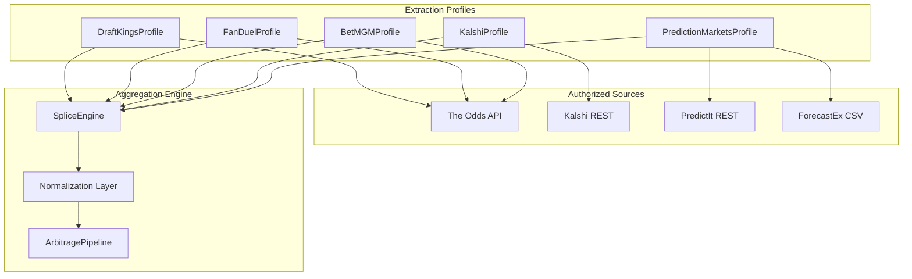

# NC Multi-Source Arbitrage Collector

Production-oriented Python package that aggregates **legal, authorized** market data for North Carolina–accessible platforms and computes cross-source arbitrage signals.

## Platforms (5 profiles)

| Profile | Data path | Auth |
|---------|-----------|------|
| **DraftKings** | [The Odds API](https://the-odds-api.com) `bookmakers=draftkings` | `ODDS_API_KEY` |
| **FanDuel** | The Odds API `bookmakers=fanduel` | `ODDS_API_KEY` |
| **BetMGM** | The Odds API `bookmakers=betmgm` | `ODDS_API_KEY` |
| **Kalshi** | [Kalshi Trade API v2](https://docs.kalshi.com) public `/markets` | None |
| **PredictIt / ForecastEx** | PredictIt `/api/marketdata/all/`; ForecastEx CSV portal | None / optional IBKR |

> **Important:** This project does **not** scrape sportsbook mobile apps or bypass operator Terms of Service, Cloudflare, Akamai, or PerimeterX. NC sportsbook lines are sourced through **The Odds API** (or your existing Optic Odds / OddsJam integration in `artifacts/api-server`). Kalshi and PredictIt use their **documented public endpoints** with rate-limit compliance.

## Architecture



### 1. Target profiles (`nc_arb_collector/profiles/`)

Each profile implements `extract() → list[MarketPacket]`. Packets may be **partial** (one leg, one platform); the splice engine completes the board.

### 2. Splice engine (`engine/splice.py`)

- Keys events with `event_match_key(home, away, market_type)` after alias normalization.
- Fuzzy-matches Kalshi / PredictIt titles to sportsbook events (`rapidfuzz`, threshold 82).
- Merges best implied probability per platform when duplicate packets arrive.

### 3. Normalization pipe (`engine/normalize.py` + `engine/arbitrage.py`)

Unified output per opportunity:

```json
{
  "timestamp": "2026-05-29T20:00:00+00:00",
  "normalized_event_name": "Duke vs North Carolina",
  "market_type": "h2h",
  "source_platform_a_odds": 145,
  "source_platform_b_odds": -130,
  "source_platform_a": "draftkings",
  "source_platform_b": "kalshi",
  "implied_probability_gap": 0.012,
  "arbitrage_yield_percentage": 1.85
}
```

## Setup

```bash
cd nc_arb_collector
python3 -m venv .venv
source .venv/bin/activate
pip install -r requirements.txt
export ODDS_API_KEY=your_key_here   # required for DK/FD/BetMGM
python -m nc_arb_collector.cli --once
```

### Environment

| Variable | Description |
|----------|-------------|
| `ODDS_API_KEY` | The Odds API key (sportsbooks) |
| `NC_ARB_SPORT_KEYS` | Comma-separated sport keys (default: NFL,NBA,NCAAB,MLB,NHL,MLS,MMA) |
| `NC_ARB_MIN_YIELD_PCT` | Minimum arb yield % (default `0.5`) |
| `NC_ARB_POLL_SEC` | Loop interval (default `45`) |
| `KALSHI_API_BASE` | Override Kalshi base URL |
| `HTTP_PROXY` | Optional corporate proxy (not for evasion) |

## HTTP client (`http/client.py`)

- Prefers `curl_cffi` with Chrome impersonation for APIs that reject generic Python clients.
- Retries 429/5xx with jittered exponential backoff.
- **Not** designed to defeat bot-management products; use only against endpoints you are permitted to access.

## Integration with this monorepo

Production Node services already merge Optic Odds + Kalshi in `artifacts/api-server/src/lib/`. This Python package mirrors that pattern for batch/ML pipelines and can share `ODDSJAM_API_KEY` / Optic adapters from `oddsjam-adapter/`.

## Compliance

- Respect each provider’s rate limits (PredictIt: **1 req/sec**).
- Do not redistribute PredictIt data commercially.
- Verify NC eligibility and account rules on each platform before placing wagers.
